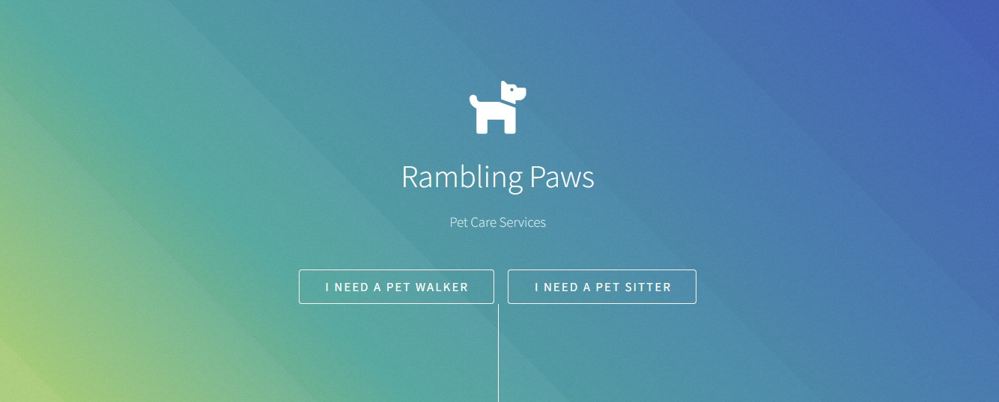

# ramblingPaws
An eye-catching website for a pet-sitting company.

Link to project: https://ramblingpaws.netlify.app/

How It's Made:
Tech used: HTML, CSS, JavaScript

Optimizations
(optional)
The option to book directly from the site would be a good upgrade for this website.

Lessons Learned:
Taking care to pay attention to every detail and keeping in regular communication with the client.
